# 🔢 Excel-13


## ✨ Project Description

**Excel-13** is a comprehensive guide to sorting data in Microsoft Excel. Explore practical tips, step-by-step instructions, and visual illustrations for sorting data by one or multiple criteria, custom sort orders, color, and more.

> 📚 **Goal:** Help you master Excel's sorting features for efficient data management—suitable for beginners and advanced users!

---

## 📒 Table of Contents

- [Sort by One Column](#-sort-by-one-column)
- [Sort by Multiple Columns](#-sort-by-multiple-columns)
- [Custom Sort Order](#-custom-sort-order)
- [Sort by Color](#-sort-by-color)
- [Reverse List Order](#-reverse-list-order)
- [SORT and SORTBY Functions](#-sort-and-sortby-functions)
- [Screenshots](#-screenshots)
- [Requirements](#-requirements)
- [Author](#-author)

---

## 1️⃣ Sort by One Column

1. Click any cell in the column you want to sort.

   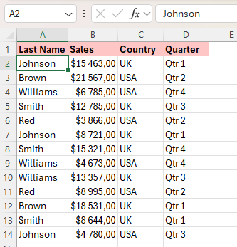

2. To sort in ascending order, on the **Data** tab, in the **Sort & Filter** group, click **A→Z**.

   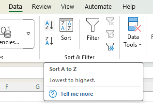

3. Result:

   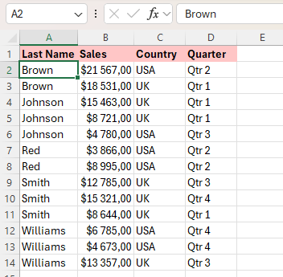

> ℹ️ To sort in descending order, click **Z→A**.

---

## 2️⃣ Sort by Multiple Columns

1. On the **Data** tab, in the **Sort & Filter** group, click **Sort**.

   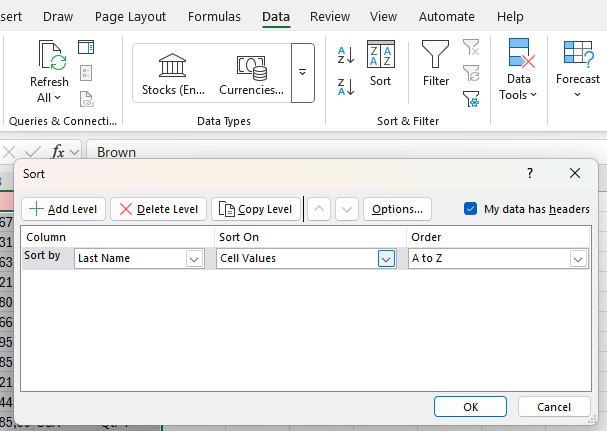

2. Select **Last Name** from the 'Sort by' drop-down list.
3. Click **Add Level**.
4. Select **Sales** from the 'Then by' drop-down list.

   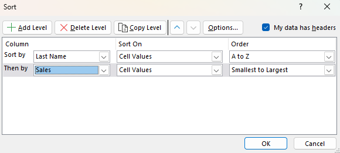

5. Click **OK**.

Result:

   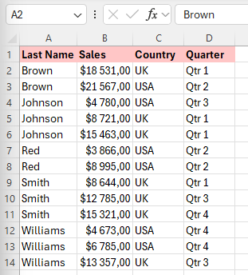

Records are sorted by Last Name first and Sales second.

---

## 🗂️ Custom Sort Order

You can use Excel to sort data in a custom order. For example, sort by Priority (High, Normal, Low):

1. Click any cell inside the data set.
2. On the **Data** tab, click **Sort**.
3. Select **Priority** from the 'Sort by' drop-down list.
4. Select **Custom List** from the 'Order' drop-down list.

   

5. Type the list entries.

   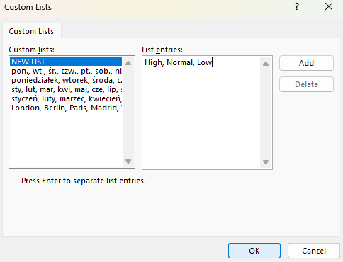

6. Click **OK** twice.

Result:

   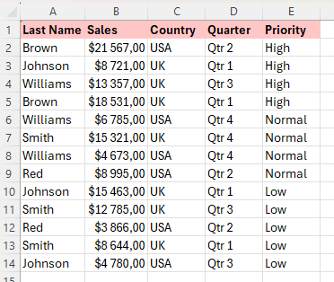

---

## 🎨 Sort by Color

1. Click any single cell inside your data set.

   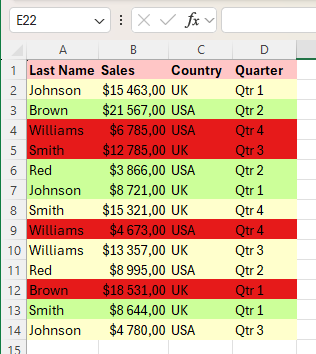

2. On the **Data** tab, click **Sort**.
3. Sort by Last Name (or another column), sort on **Cell Color** (or **Font Color**/**Cell Icon**), and select the green color for the first level.
4. Click **Copy Level** two times and select the other colors.

   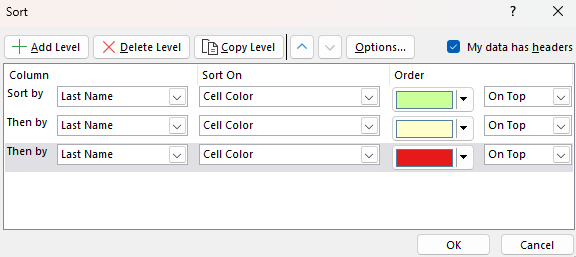

5. Click **OK**.

Result:

   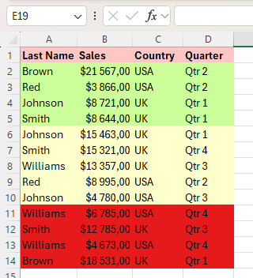

---

## 🔁 Reverse List Order

1. Use the **SEQUENCE** function to generate a list of numbers.  
   For example:  
   ```excel
   =SEQUENCE(8,1,1,1)
   ```
   *(Requires Excel 2021 or Excel 365)*

   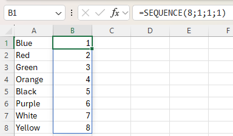

2. The **SORTBY** function sorts a range based on values in a corresponding range (use `-1` for descending order):

   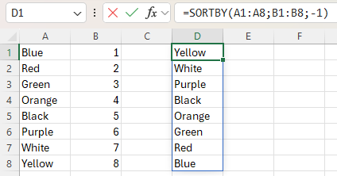

3. Nest the **SEQUENCE** function inside the **SORTBY** function:

   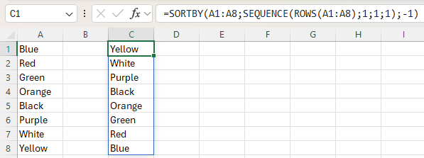

> 📝 The **ROWS** function simply counts the number of rows in a range.

If you don't have SEQUENCE, you can fill numbers manually, then sort by that column in descending order.

---

## 🧮 SORT and SORTBY Functions

Use the **SORT** function in Excel 365/2021 to sort your data by one or multiple columns.

1. The simple SORT function:
   ```excel
   =SORT(A2:D10)
   ```
   *(Sorts by the first column in ascending order)*

   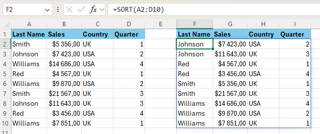

2. Sort by a different column:
   ```excel
   =SORT(A2:D10, 2)
   ```
   *(Sorts by the second column)*

   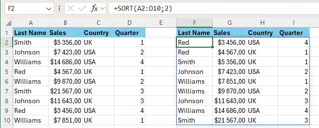

3. Sort in descending order:
   ```excel
   =SORT(A2:D10, 2, -1)
   ```
   *(Second column, descending)*

   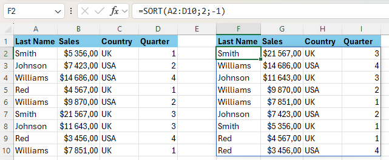

4. Sort by multiple columns:
   ```excel
   =SORT(A2:D10, {2, 1}, {1, -1})
   ```
   *(By Last Name ascending, then by Sales descending)*

   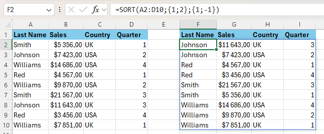

---

## 📷 Screenshots

All screenshots referenced above can be found in the `/Screenshots` folder.

---

## ℹ️ Requirements

- Microsoft Excel (recommended: 2021/365 for modern formulas)
- Windows OS (for custom list sorting)

---

## 👨‍💻 Author

Project and documentation by **Kuba27x**  
Repository: [Kuba27x/Excel-13](https://github.com/Kuba27x/Excel-13)

---
