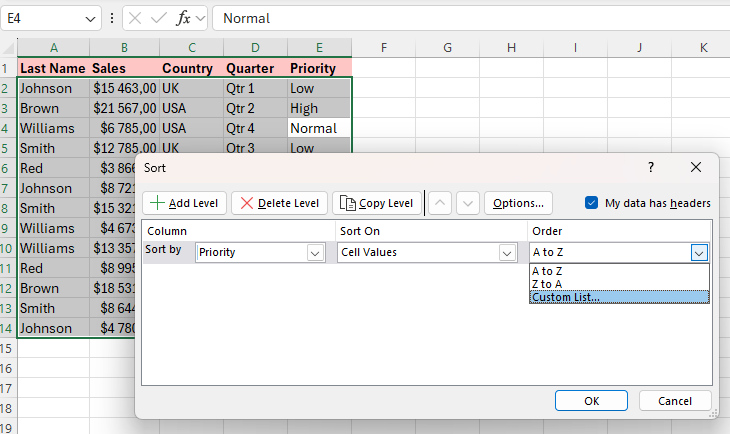

Excel-13

Project Description

Excel-13 is a guide to sorting data in Microsoft Excel. Explore practical tips, instructions, and illustrations for sorting data by multiple criteria.

Table of Contents

Sort by One Column

1. Click any cell in the column you want to sort.

2. To sort in ascending order, on the Data tab, in the Sort & Filter group, click AZ.

3. Result:

(Note: to sort in descending order, click ZA.)

Sort by Multiple Columns

1. On the Data tab, in the Sort & Filter group, click Sort.

2. Select Last Name from the 'Sort by' drop-down list.
3. Click on Add Level.
4. Select Sales from the 'Then by' drop-down list.

5. Click OK.
6. Result:

Records are sorted by Last Name first and Sales second.

Custom Sort Order

You can use Excel to sort data in a custom order. In the example below, we would like to sort by Priority (High, Normal, Low).

1. Click any cell inside the data set.
2. On the Data tab, in the Sort & Filter group, click Sort.
3. Select Priority from the 'Sort by' drop-down list.
4. Select Custom List from the 'Order' drop-down list.

5. Type the list entries.

6. Click OK.
7. Click OK again.
8. Result:

Sort by Color

1. Click any single cell inside a data set.

2. On the Data tab, in the Sort & Filter group, click Sort.
3. Sort by Last Name (or any other column), sort on Cell Color (you can also sort on Font Color and Cell Icon), and select the green color for the first level.
4. Click 'Copy Level' two times and select the other colors.

5. Click OK.
6. Result:

Reverse List Order

1. First, use the SEQUENCE function to generate a list of numbers. The SEQUENCE function below has 4 arguments. Rows = 8, Columns = 1, Start = 1, Step = 1.

(Note: You need to have Excel 2021 or Excel 365 to use SEQUENCE function. If you dont have it enter the value 1 into cell B1 and the value 2 into cell B2. 
Select the range B1:B2, click the lower right corner of this range, and drag it down to cell B8. Click any number in the list in column B. To sort in descending order, on the Data tab, in the Sort & Filter group, click ZA.
Result: not only the list in column B, but also the list in column A has been reversed.)

2. The SORTBY function sorts a range based on the values in a corresponding range. Use -1 (third argument) to sort in descending order.

3. Nest the SEQUENCE function inside the SORTBY function.

(Note: the ROWS function simply counts the number of rows in a range.)

SORT 

Use the SORT function in Excel 365/2021 to sort your Excel data by one column or multiple columns.

1. The simple SORT function below has only 1 argument (A2:D10). By default, the SORT function sorts by the first column, in ascending order.

2. Use the second argument of the SORT function to sort by a different column. The SORT function below sorts by the second column.

3. Use the third argument of the SORT function to sort in a different order. The SORT function below sorts by the second column, in descending order.

4. To sort by multiple columns, simply supply an array constant. Second array is for ascending/descending order. The SORT function below sorts by Last Name first (in ascending order) and by Sales second (in descending order).

